# Sumário

1. [Softwares Utilizados](#softwares-utilizados)
  1. [Arduino IDE](#arduino-ide)
2. [Preparativos](#preparativos)
  1. [Partes](#preparativos)
  2. [Configurações do software Arduino IDE](#configurações-do-software-arduino-ide)
  3. [Eletrônica](#eletrônica)
  4. [Código](#código)
  5. [O que aconteceu?](#o-que-aconteceu)
  6. [Portas de saida](#portas-de-saída)
  7. [Comandos aprendidos](#comandos-aprendidos)
3. [Sensor de luminosidade](#sensor-de-luminosidade)
  1. [Partes](#partes-1)
  2. [Eletrônica](#eletrônica-1)
  3. [Código](#código-1)
  4. [O que aconteceu?](#o-que-aconteceu-1)
  5. [Comandos aprendidos](#comandos-aprendidos-1)
4. [Sensor de umidade de solo (Higrômetro)](#sensor-de-umidade-de-solo-higrômetro)
  1. [Partes](#partes-2)
  2. [Eletrônica](#eletrônica-2)
  3. [Código](#código-2)
  4. [Considerações](#considerações)
5. [Sensor de temperatura e umidade do ar (DHT11)](#sensor-de-temperatura-e-umidade-do-ar-dht11)
  1. [Partes](#partes-3)
  2. [Eletrônica](#eletrônica-3)
  3. [Código](#código-3)
  4. [Considerações](#considerações-1)
6. [Circuito Completo](#circuito-completo)
  1. [Código](#código-4)
7. [ThingSpeak](#thingspeak)
  1. [Criando e configurando uma conta no ThingSpeak](#criando-e-configurando-uma-conta-no-thingspeak)
  2. [Configurando WiFi](#configurando-wifi)
  3. [Enviando dados ao ThingSpeak](#enviando-dados-ao-thingspeak)
8. [IFTTT](#ifttt)
  1. [Criando e configurando uma conta no IFTTT](#criando-e-configurando-uma-conta-no-ifttt)
  2. [Enviando alerta pelo IFTTT](#enviando-alerta-pelo-ifttt)
9. [Código completo](#código-completo)

# Softwares Utilizados

Para desenvolver os laboratórios deste guia utilizaremos o software Arduino IDE para programação do microcontrolador.

## Arduino IDE

O Arduino IDE permite que a placa Arduino seja programada de forma fácil, sem se preocupar com muitos detalhes que envolvem a compilação e a transferência do programa para a placa do Arduino. Para utilizar basta baixar o programa utilizando o link: https://www.arduino.cc/en/Main/Software.

Ao abrir o programa pela primeira vez você verá uma tela como a imagem abaixo:

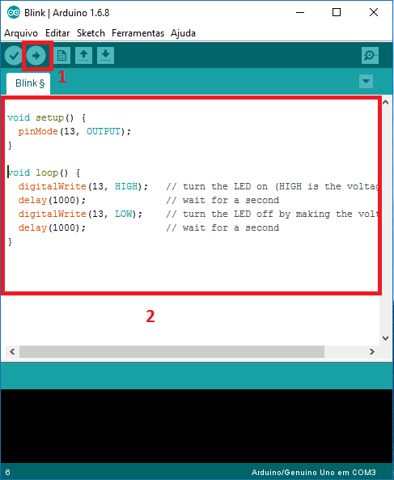

O botão 1 serve para compilarmos executarmos o código na placa Arduino. Na área 2 está o código que será executado.

# Preparativos

Para que seja possível a programação do kit de desenvolvimento NodeMCU com o Arduino IDE, faz-se necessário algumas configurações. Detalharemos cada etapa deste processo neste laboratório.

Nesse laboratório controlaremos o acionamento de um LED utilizando o NodeMCU. Para ligar os componentes eletrônicos utilizaremos uma protoboard. A protoboard permite ligar os componentes sem a necessidade de soldá-los definitivamente.

## Partes

* 1x Cabo MicroSD
* 1x NodeMCU
* 1x Protoboard
* Arduino IDE instalado ([Link para download](https://www.arduino.cc/en/Main/Software))
* Driver CP2102 NodeMCU ([Link para download](http://www.silabs.com/products/mcu/pages/usbtouartbridgevcpdrivers.aspx))

## Configurações do software Arduino IDE

Passo a passo para configuração do software, **após instalação da IDE do Arduino e Driver CP2102**:

Entre na IDE do Arduino e clique em **Arquivo → Configuraçõe****s**

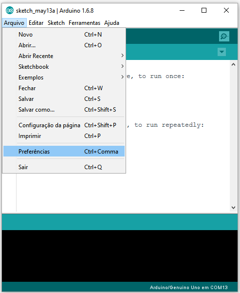

Na tela seguinte, digite "http://arduino.esp8266.com/stable/package_esp8266com_index.json" abaixo no campo **URLs adicionais de Gerenciadores de Placas:**


Clique em OK para retornar à tela principal da ID. Agora clique em **Ferramentas -> Placa -> Gerenciador de Placas:**

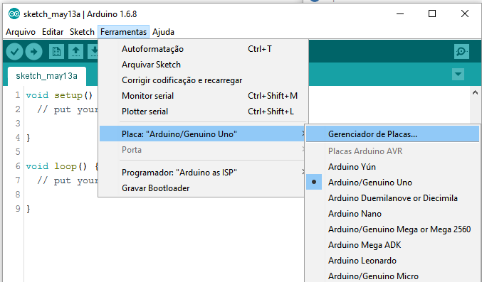

Utilize a barra de rolagem para encontrar o **esp8266 by ESP8266 Community** e clique em **INSTALAR**

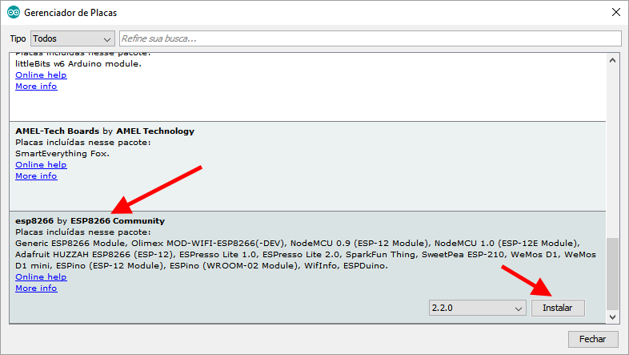

Após alguns minutos as placas da linha ESP8266 já estarão disponíveis na lista de placas da IDE do Arduino. No menu **Ferramentas → Placas**, selecione a placa **NodeMCU 1.0 (ESP-12E Module).**


O último passo é programar o NodeMCU com IDE Arduino, e vamos fazer isso utilizando o LED existente no kit: Carregue na IDE o exemplo **Blink**. (Arquivo → Exemplos → ESP8266 → Blink). Compile e faça o upload do código** **para testar a conexão entre o computador e o kit de desenvolvimento.

## Eletrônica

         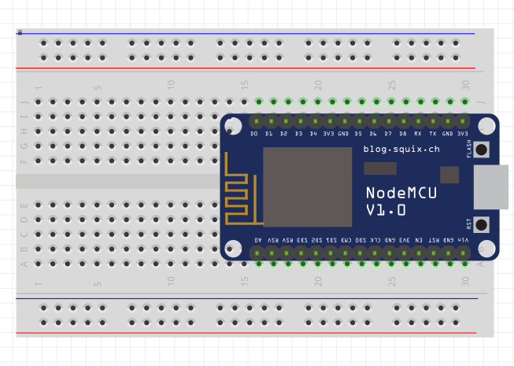

## Código

```cpp
void setup() {
  pinMode(LED_BUILTIN, OUTPUT); // Initialize the LED_BUILTIN pin as an output
}

// the loop function runs over and over again forever
void loop() {
  digitalWrite(LED_BUILTIN, LOW);   // Turn the LED on
  delay(1000);                      // Wait for a second
  digitalWrite(LED_BUILTIN, HIGH);  // Turn the LED off by making the voltage HIGH
  delay(2000);                      // Wait for two seconds (to demonstrate the active low LED)
}
```

## O que aconteceu?

Para que o microcontrolador saiba o que fazer é necessário programá-lo. O programa descrito acima possui duas partes, a função **setup** e a **loop**. A função setup é executada uma única vez quando o NodeMCU é ligado. Já a função **loop** é executada repetidamente. O NodeMCU fica executando a função **loop** continuamente, quando ela termina, ela começa do início novamente.

## Portas de saída

O NodeMCU possui diversas portas para se comunicar com o mundo externo, acender luzes, verificar o valor de sensores (ex: um sensor de temperatura). No NodeMCU uma mesma porta pode funcionar como entrada ou saída, para isso precisamos informar o microcontrolador como a porta deve ser tratada (entrada ou saída). Nesse caso a porta funciona como saída, então na função **setup** é executado o comando **pinMode(LED_BUILTIN, OUTPUT)**.

A função **loop** é o coração do programa, ela é executada repetidamente até que o microcontrolador seja desligado. No programa acima utilizamos o comando **digitalWrite(led, HIGH)** para ligar o LED e digitalWrite(led, LOW) para desligá-lo. Repare que a única diferença é o HIGH e LOW.  O comando delay(2000) permite fazer o Arduino esperar um período de tempo. Esse período deve ser informado em **milisegundos**.

## Comandos aprendidos

<table>
  <tr>
    <td>Comando</td>
    <td>Descrição</td>
  </tr>
  <tr>
    <td>pinMode(porta, OUTPUT);</td>
    <td>Configura uma porta como saída.</td>
  </tr>
  <tr>
    <td>digitalWrite(porta, HIGH);</td>
    <td>Liga uma porta</td>
  </tr>
  <tr>
    <td>digitalWrite(porta, LOW);</td>
    <td>Desliga uma porta</td>
  </tr>
  <tr>
    <td>delay(tempo);</td>
    <td>Faz o Arduino esperar um período de tempo em milisegundos</td>
  </tr>
</table>


# Sensor de luminosidade

Iniciaremos a partir deste laboratório a montagem do circuito de medição dos sensores da oficina. O sensor de luminosidade (LDR) é um componente cuja resistência varia de acordo com a intensidade da luz. Quanto mais luz incidir sobre o componente, menor a resistência.

## Partes

* 1x NodeMCU
* 1x Protoboard
* 1x Sensor de Luminosidade (LDR)
* 1x Resistor 10kΩ
* Cabos para ligações

## Eletrônica

 

## Código

```cpp
#define LDRPIN A0 // Pino sensor de luminosidade

void setup() {
  Serial.begin(115200);
}

void loop() {
  luminosidade();
  Serial.println(""); //pula linha no serial monitor
}

void luminosidade(){
  float leitura_lumi = analogRead(LDRPIN); //lê o valor fornecido pelo LDR
  float lumi = map(leitura_lumi, 1023, 0, 0, 1000); //conversao para lux aproximada

  lumin = lumi; //variavel global para atualizar thingspeak
  Serial.print(" Luminosidade: ");
  Serial.print(lumi);
  Serial.print(" lux");
}
```

## O que aconteceu?

Neste exercício, temos o código de leitura do sensor de luminosidade (analógico). Repare que a função "**luminosidade**" é criada externa ao **loop**, porém para que ela seja executada é necessário chamá-la no código principal (**loop**). A leitura do sensor é feita através do comando **analogRead**. Após a leitura, é utilizado o comando **map**, para converter o sinal lido (0-1023) para valores correspondentes a unidade de medida de luminosidade (lux). Importante ressaltar que os valores apresentados não representam a real luminosidade, pois para tal seria necessária uma calibração com instrumento de medida confiável (luxímetro).

## Comandos aprendidos

<table>
  <tr>
    <td>Comando</td>
    <td>Descrição</td>
  </tr>
  <tr>
    <td>analogRead(porta);</td>
    <td>Lê uma porta analógica</td>
  </tr>
  <tr>
    <td>float leitura = analogRead(porta);</td>
    <td>Captura o valor de uma entrada analógica e o guarda em "leitura"</td>
  </tr>
  <tr>
    <td>map(fromLow, fromHigh, toLow, toHigh)</td>
    <td>Converte um número de um intervalo para outro.</td>
  </tr>
  <tr>
    <td>Serial.print("texto");</td>
    <td>Escreve uma palavra/variável no Serial, podendo ser lida no Serial Monitor.</td>
  </tr>
  <tr>
    <td>Serial.begin(115200)</td>
    <td>Configura a comunicação entre o kit e o computador</td>
  </tr>
</table>


# Sensor de umidade de solo (Higrômetro)

O sensor de umidade de solo pode ser utilizado como analógico ou digital. Quando utilizado como analógico, o valor lido representa a porcentagem de umidade do solo. Já quando usado como digital, representa dois estados: seco (estado alto) e úmido (estado baixo). No exercício em questão, faremos a leitura digital do sensor.

## Partes

* 1x NodeMCU
* 1x Protoboard
* Sensor de umidade (Higrômetro)
* Cabos para ligações

## Eletrônica

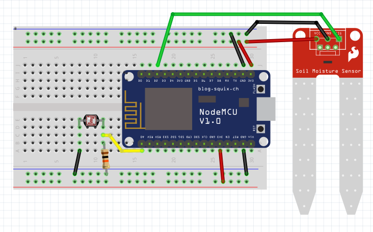

## Código

```cpp
#define UMIDPIN D1 //pino sensor umidade de solo

void setup() {
  pinMode(UMIDPIN, INPUT);
  Serial.begin(115200);
}

void loop() {
  umidade_solo();
  Serial.println(""); //pula linha no Serial Monitor
}

void umidade_solo(){
  int umid = digitalRead(UMIDPIN); //lê o valor da entrada analógica
  delay(300);
  Serial.print("UmidSolo: ");
  Serial.print(umid); //1 = seco; 0 = umido.
}
```

## Considerações

Para fins de teste, utilize um copo com água para variar a leitura entre seco e molhado. Deste modo é possível identificar o bom funcionamento do sensor e código. Ajustes no potenciômetro da placa do comparador LM393 podem ser necessários para o bom funcionamento do sensor.

# Sensor de temperatura e umidade do ar (DHT11)

O sensor de temperatura e umidade **DHT11** permite realizarmos leituras de temperaturas entre **0 e 50ºC** e umidade entre **20 e 90%**. O elemento sensor de temperatura é um termistor do tipo NTC e o sensor de umidade é do tipo HR202. O circuito interno faz a leitura dos sensores e se comunica com o microcontrolador através de uma única via.

## Partes

* 1x NodeMCU
* 1x Protoboard
* Sensor de temperatura e umidade (DHT11)
* Cabos para ligações
* Bibliotecas do sensor DHT11 ([Link para download](https://learn.adafruit.com/dht/downloads))

## Eletrônica

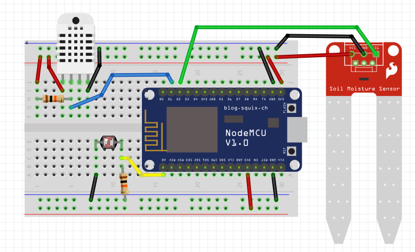

## Código

```cpp
#include "DHT.h" //biblioteca do sensor DHT

#define DHTPIN D2 //pino ligado ao sensor DHT (umid e temp do ar)
#define DHTTYPE DHT11  //modelo do sensor, DHT11.

DHT dht(DHTPIN, DHTTYPE); //define porta e tipo do sensor a ser usado pela biblioteca.

void setup() {
  dht.begin(); //inicia sensor DHT11
  Serial.begin(115200);
}

void loop() {
  temp_umid();
  Serial.println(""); //pula linha no Serial Monitor
}

void temp_umid(){
  float h = dht.readHumidity(); //comando da biblioteca para leitura da umidade
  float t = dht.readTemperature(); //comando da biblioteca para leitura da temperatura
  delay(300);

  if (isnan(t) || isnan(h)){
    Serial.print("Failed to read from DHT");
  } else {
    Serial.print("Umidade: ");
    Serial.print(h);
    Serial.print(" %");
    Serial.print(" | ");
    Serial.print(" Temperatura: ");
    Serial.print(t);
    Serial.print(" *C");
  }
}
```

## Considerações

Neste experimento é utilizado alguns comandos específicos da biblioteca do sensor DHT, os quais facilitam a programação do mesmo.

# Circuito Completo

Com todos os sensores conectados ao kit, temos também o código englobando todos os respectivos códigos de leitura:

## Código

```cpp
#include "DHT.h"

#define DHTPIN D2 //pino ligado ao sensor DHT (umid e temp do ar)
#define DHTTYPE DHT11  //modelo do sensor, DHT11.
#define UMIDPIN D1 //pino sensor umidade de solo
#define LDRPIN A0 //pino sensor de luminosidade

//Variáveis globais, usadas para atualizar ThingSpeak
int umid_solo = 0;
int umid_ar = 0;
int temp = 0;
int lumin = 0;

void setup() {
  dht.begin(); //inicia sensor DHT11
  pinMode(LED_BUILTIN, OUTPUT); //define pino do LED como saida
  pinMode(DHTPIN, INPUT);
  pinMode(UMIDPIN, INPUT);
  Serial.begin(115200);
}

void loop() {
  umidade_solo(); //leitura de umidade de solo
  Serial.print(" | ");

  temp_umid(); //leitura sensor temp e umid AR
  Serial.print(" | ");

  luminosidade();
  Serial.print(" | ");

  Serial.println(""); //pula linha no serial monitor
}

////--------------Sensor de Umid de Solo------------

void umidade_solo(){
  int umid = digitalRead(UMIDPIN); //lê o valor da entrada analógica
  umid_solo = umid; //variavel global para atualizar thingspeak

  delay(300);

  Serial.print("UmidSolo: ");
  Serial.print(umid); //1 = seco; 0 = umido.
}

////-------------Sensor temp e umid do ar---------

void temp_umid(){
  float h = dht.readHumidity();
  float t = dht.readTemperature();
  umid_ar = h; //variavel global para atualizar thingspeak
  temp = t; //variavel global para atualizar thingspeak

  delay(300);

  if (isnan(t) || isnan(h)) {
    Serial.print("Failed to read from DHT");
  } else {
    Serial.print("Umidade: ");
    Serial.print(h);
    Serial.print(" %");
    Serial.print(" | ");
    Serial.print(" Temperatura: ");
    Serial.print(t);
    Serial.print(" *C");
  }
}

////------------Sensor LDR---------------------

void luminosidade(){
  float leitura_lumi = analogRead(LDRPIN); //lê o valor fornecido pelo LDR
  float lumi = map(leitura_lumi, 1023, 0, 0, 1000); //conversao para lux aproximada

  lumin = lumi; //variavel global para atualizar thingspeak

  Serial.print(" Luminosidade: ");
  Serial.print(lumi);
  Serial.print(" lux");
}
```

# ThingSpeak

O primeiro passo para efetivamente ligarmos nossa planta à Internet é criar um servidor para armazenar os dados coletados pelos sensores. Um "servidor" é um tipo específico de *software *(ou computador) que fornece serviços a usuários ou outros *softwares* (do tipo “cliente”).

Quando você usa a Internet através do seu navegador favorito, por exemplo, você está constantemente fazendo requisições para servidores - requisitando, por exemplo, pela página inicial do Facebook ou requisitando que uma determinada mensagem de texto seja transmitida para um amigo seu. No nosso caso, iremos criar um servidor para guardarmos informações da nossa planta ("servidor, guarde essas informações da planta") e para visualizar esses dados (“servidor, mostre-me as informações da planta”).

Existem inúmeras abordagens que podemos utilizar para criar um servidor. Uma abordagem muito comum, por exemplo, é utilizar uma máquina física e configurá-la para atuar como servidor. Não precisamos de uma máquina física para fazer isso pois usaremos a "*nuvem"* para isso. Ou seja, utilizaremos um serviço da Internet que irá nos fornecer um servidor pronto para ser utilizado. Dentre os vários serviços que existem, escolhemos o [ThingSpeak](https://thingspeak.com/).

## Criando e configurando uma conta no ThingSpeak

Iremos criar um "canal" para coletarmos os dados da planta e termos acesso a um painel com os gráficos desses dados. Neste caso iremos enviar dados de umidade do ar, temperatura e luminosidade.

Primeiramente, acesse [https://thingspeak.com/](https://thingspeak.com/). Siga as instruções em cada uma das imagens a seguir.


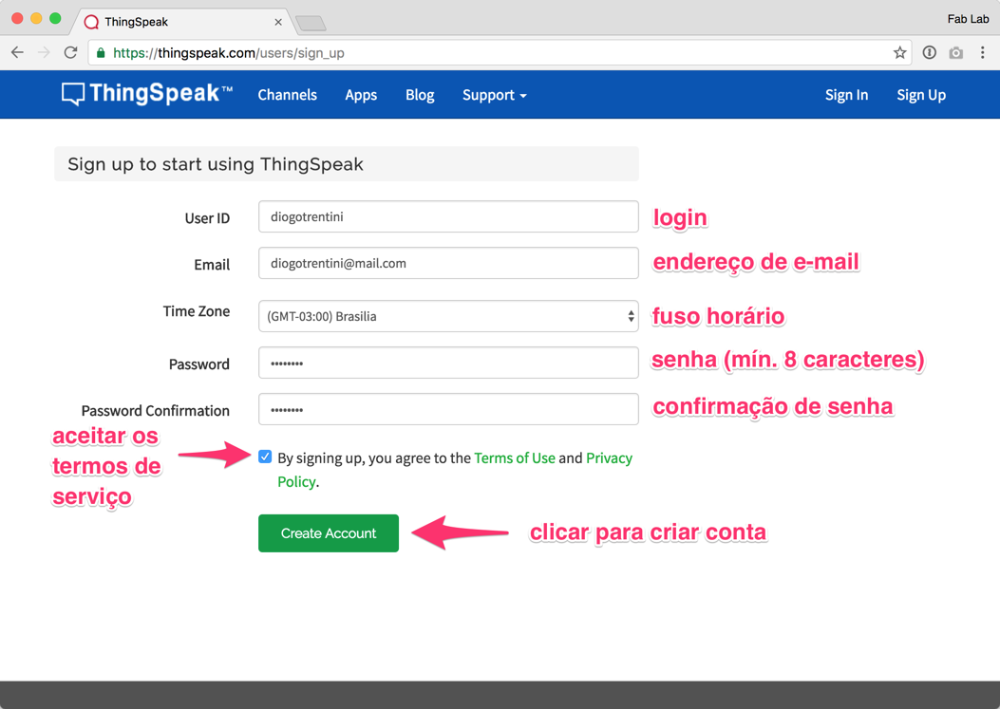

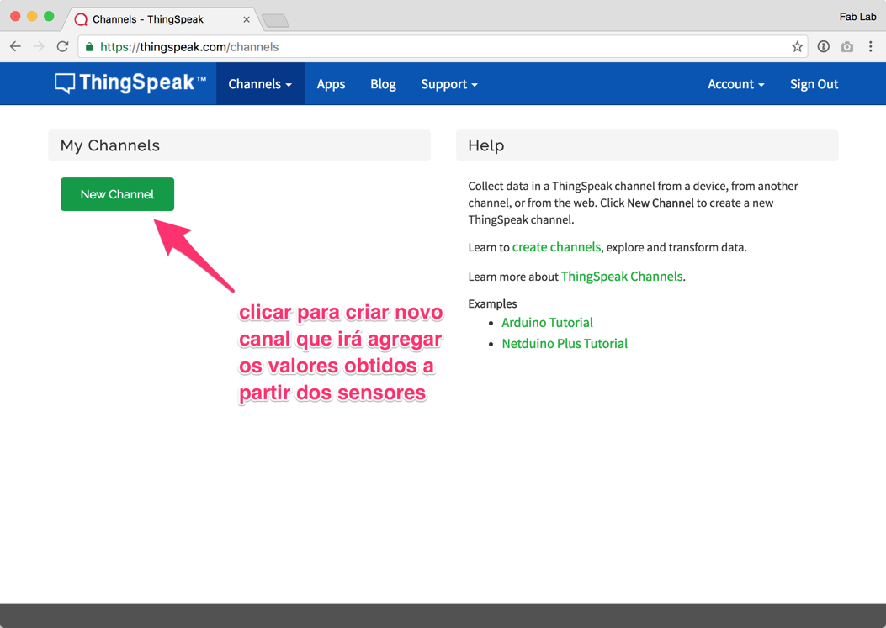


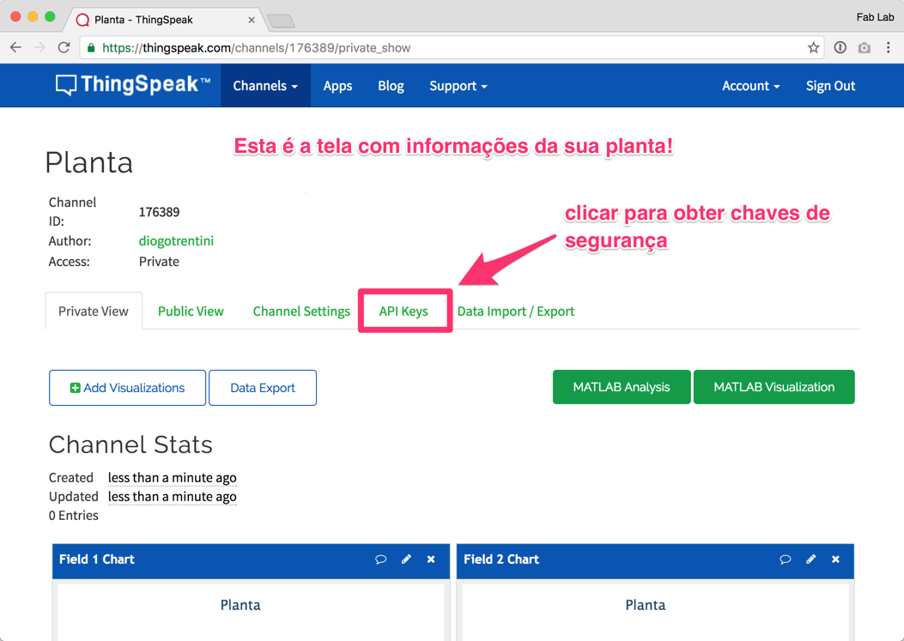

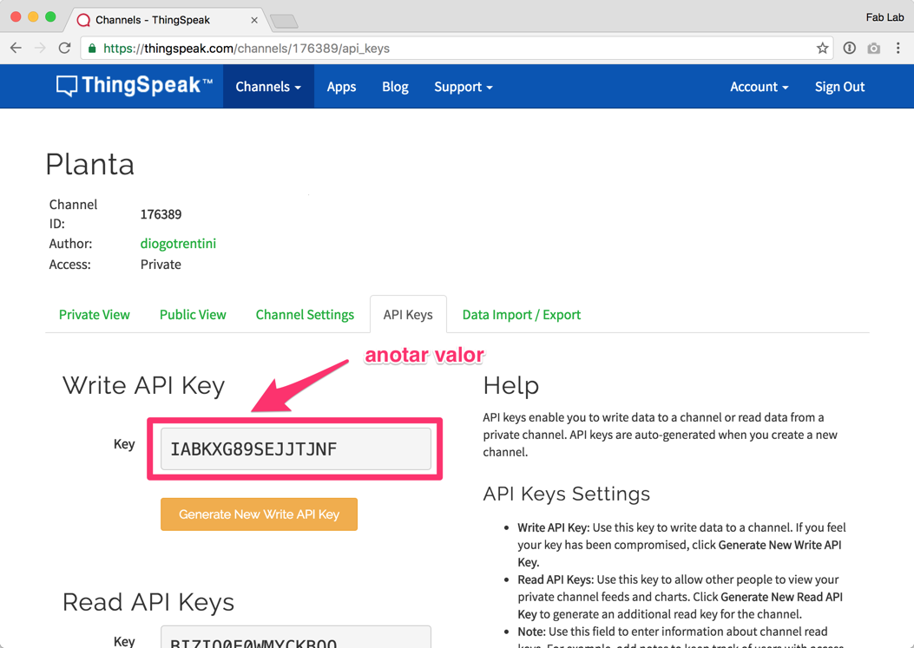

O valor na última imagem, que deve ser anotado, é a "chave de API". Com ela nós podemos nos “autenticar” em nosso servidor - ou seja, “provar” para nosso servidor que somos nós mesmos que estamos enviando dados a ele, e não uma outra pessoa qualquer. Se não utilizarmos um sistema de segurança como esse, qualquer pessoa pode visualizar e modificar os dados que enviamos ao servidor - e isso normalmente não é uma coisa boa!

## Configurando WiFi

Vamos agora implementar o código para configurar e inicializar uma conexão de com um roteador WiFi no nosso NodeMCU. Para isso, usaremos uma biblioteca chamada ESP8266WiFiMulti que irá realizar todo o processo de conexão com WiFi. Desse modo, só precisamos informar o nome e senha da nossa rede Wifi e pronto, a biblioteca cuida do resto!

No código a seguir, lembre-se de atualizar as constantes SSID com o nome da sua rede WiFi, PASSWORD com a senha da sua rede WiFi!

```cpp
#include <ESP8266WiFiMulti.h>

// Configuração da rede WiFi.
const int HTTP_PORT= 80;
const char* SSID = "SOFTVILLE"; // ATUALIZAR
const char* PASSWORD = "softville:-)"; // ATUALIZAR

ESP8266WiFiMulti wifi;

void setup() {
  // Configura WiFi.
  wifi.addAP(SSID, PASSWORD);
}

void loop() {
  // Se a WiFi está devidamente configurada e conectada.

  if (wifi.run() == WL_CONNECTED) {
    // Executa algo.
  }
}
```

## Enviando dados ao ThingSpeak

Para enviar os dados para o ThingSpeak, iremos utilizar um "protocolo". Protocolos são convenções criadas para os computadores conseguirem se comunicar entre si. Do mesmo modo que nós humanos possuímos protocolos para determinadas situações - como comprimentar uma pessoa ao iniciar uma conversa - os computadores também precisam trocar dados de uma certa maneira para todos se entenderem. No nosso caso, iremos utilizar um dos protocolos mais utilizados, o [HTTP](https://pt.wikipedia.org/wiki/Hypertext_Transfer_Protocol). Você muito provavelmente já utilizou muito este protocolo! Ao acessar uma página web, como [www.facebook.com](http://www.facebook.com), você utiliza o protocolo HTTP para se comunicar com um servidor do Facebook e “pegar” a página inicial deles. O servidor na outra ponta irá entender o protocolo e saberá responder a sua requisição, enviando a página desejada corretamente.

Para enviar os dados do ThingSpeak utilizando o protocolo HTTP iremos utilizar uma outra biblioteca (do mesmo modo que fizemos com a WiFi) chamada ESP8266HTTPClient. Ela implementa toda a complexidade por trás do protocolo deixando-nos apenas com a parte fácil:

1. Definir o que queremos fazer (enviar dados)

2. Definir o servidor / host (no caso, o servidor do ThingSpeak)

3. Definir os dados que queremos enviar (os valores obtidos dos sensores)

Para enviar dados para sua planta, iremos utilizar o código a seguir. Lembre-se de atualizar a constante TS_API_KEY com a chave de API (no exemplo, IABKXG89SEJJTJNF) que você anotou no último passo da criação da conta e "canal" do ThingSpeak.

```cpp
#include <ESP8266HTTPClient.h>

// Configuracao do ThingSpeak.
const char* TS_HOST = "api.thingspeak.com";
const char* TS_URL = "/update";
const char* TS_API_KEY = ""; // ATUALIZAR

int umid_ar = 0;
int temp = 0;
int lumin = 0;

void loop() {
  // Lê sensores de tempertura, umidade do ar e luminosidade.
  temp_umid();
  luminosidade();

  // Se a WiFi esta devidamente configurada e conectada.
  if (wifi.run() == WL_CONNECTED) {
    // Envia dados para o ThingSpeak e espera um periodo curto de tempo.
    updateThingSpeak();

    delay(5000);
  }
}

// Envia dados para ThingSpeak.
void updateThingSpeak() {
  HTTPClient client;

  // Constrói URL para enviar dados ao ThingSpeak, com cada dado e chave da API.
  String url = String(TS_URL) +
    "?api_key=" + TS_API_KEY +
    "&field1=" + temp +
    "&field2=" + umid_ar +
    "&field3=" + lumin;

  // Especifica servidor, porta do processo e URL de envio de dados e inicia
  // um canal de comunicação com o servidor.
  client.begin(TS_HOST, HTTP_PORT, url);

  // Faz requisição e guarda código de retorno.
  int codigoHTTP = client.GET();

  // Fecha o canal de comunicação com o servidor.
  client.end();

  // Mostra código de retorno (se foi um sucesso ou fracasso, por exemplo).
  Serial.println(String("ThingSpeak retornou HTTP CODE ") + codigoHTTP);
}
```

# IFTTT

Agora que temos os dados da planta na *nuvem *e conseguimos facilmente visualizá-los, iremos criar um alerta para recebermos um e-mail quando nossa planta estiver seca necessitando de água. Para isso, utilizaremos mais um serviço para facilitar nossa vida.

O IFTTT ("**I**f **T**his, **T**hen **T**hat") permite que criemos um servidor “especial”. Esse servidor é extremamente simples: ele espera um evento de acionamento (um *trigger*) para executar uma determinada tarefa. Por exemplo, podemos criar regras do tipo:

* **Se** alguém me marcar em alguma foto no Facebook **então** envie esta foto para o meu Dropbox;

* **Se** for chover hoje **então** envie um e-mail me avisando sobre isso;

* **Se** um evento do meu calendário estiver próximo de acontecer **então** envie um SMS para meu celular.

## Criando e configurando uma conta no IFTTT

Iremos configurar uma "receita" para recebermos um e-mail nos alertando que nossa planta está sem água. Também podemos enviar um SMS ou criar um tweet. Ou qualquer coisa que nossa imaginação permitir!

Primeiramente, acesse [https://ifttt.com/](https://ifttt.com/). Siga as instruções em cada uma das imagens a seguir:


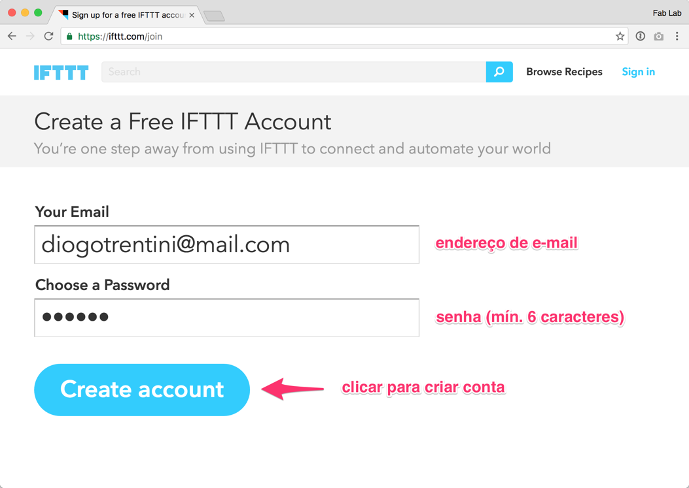


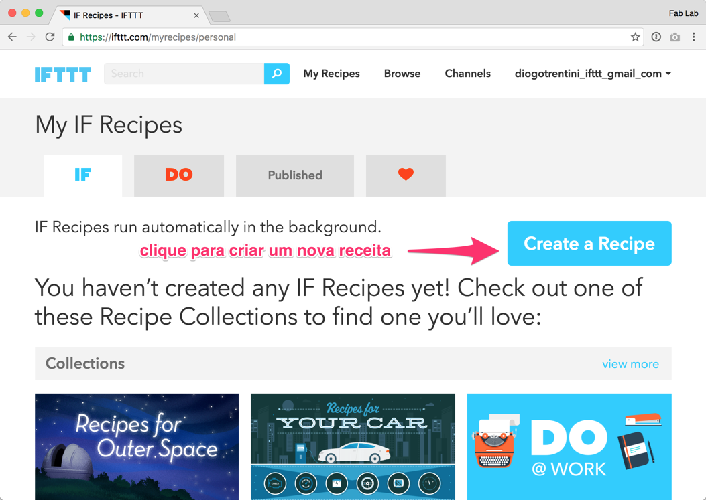

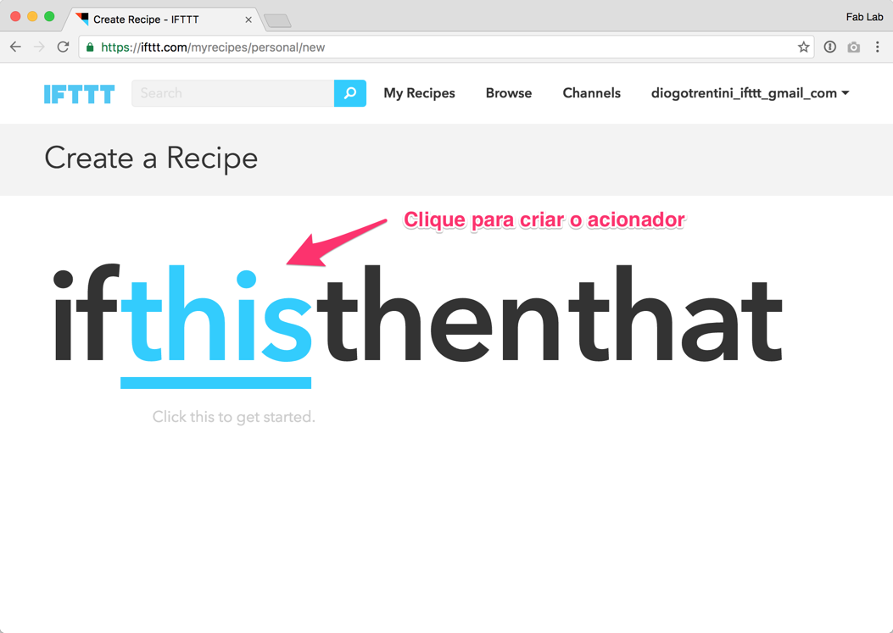


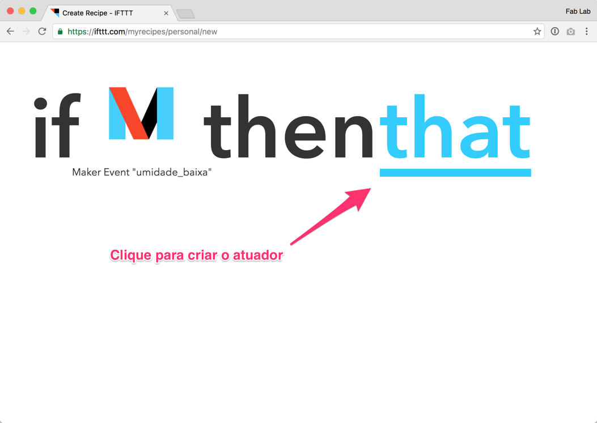

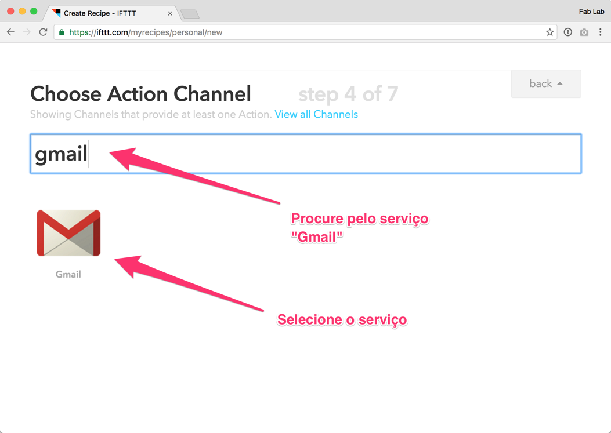

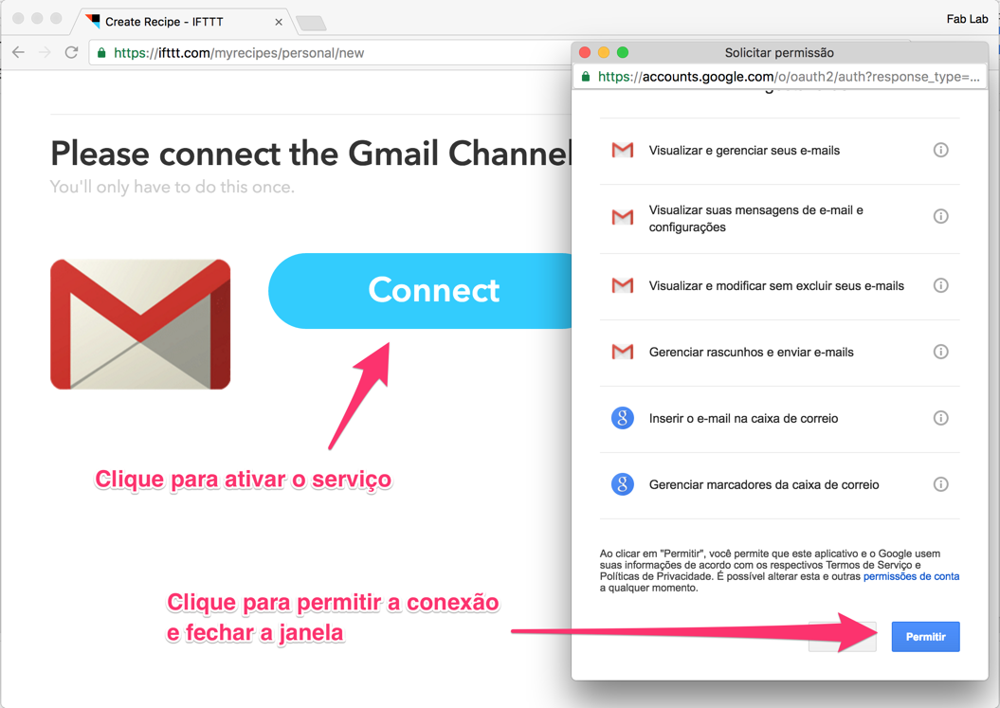

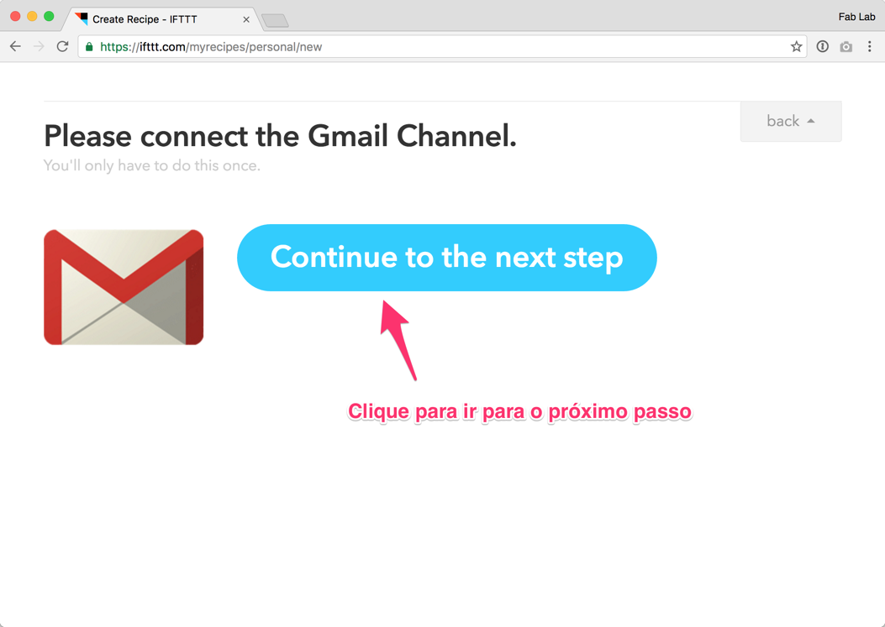


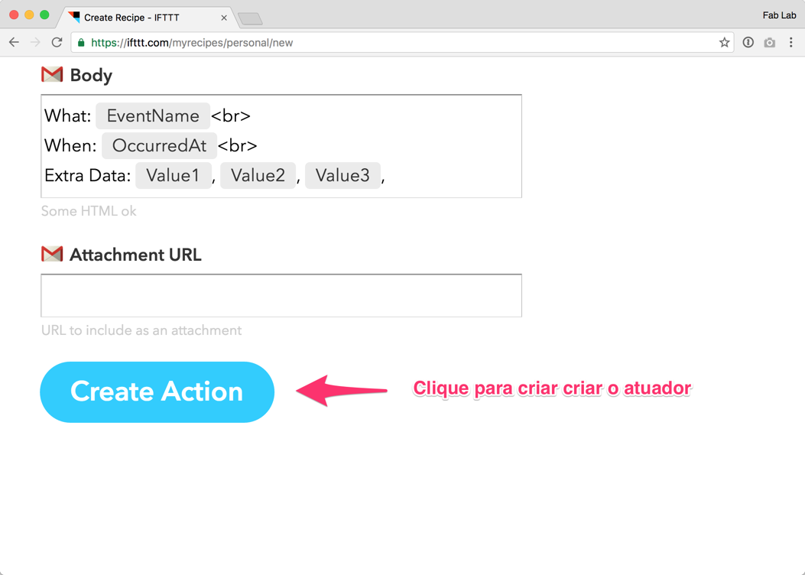


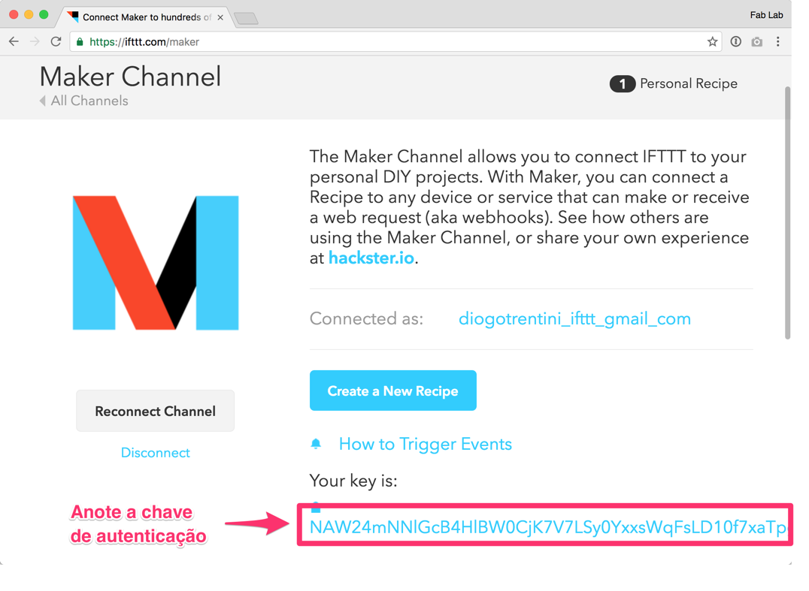

Assim como no ThingSpeak, o valor na última imagem, que deve ser anotado, é a "chave de API". Também a utilizamos para “provar” para nosso servidor que somos nós que estamos enviando um determinado alerta. Novamente, temos que ter segurança! Não podemos deixar qualquer pessoa mandando alertas falsos para acharmos que nossa planta está precisando de água - isso seria algo muito chato :(

## Enviando alerta pelo IFTTT

Para ativar um alerta pelo IFTTT, iremos utilizar novamente o protocolo HTTP com o código a seguir (além de, é claro, reaproveitar o código anterior referente ao ThingSpeak). Lembre-se de atualizar as constantes IFTTT_URL com o nome do seu evento (no exemplo, umidade_baixa) no lugar de `<EVENT>` e IFTTT_API_KEY com a chave de API (no exemplo, NAW24mNNIGc...) que você anotou no último passo da criação da conta e "receita" do IFTTT.

```cpp
// Configuração do IFTTT.
const char* IFTTT_HOST = "maker.ifttt.com";
const char* IFTTT_URL = "/trigger/<EVENT>/with/key/"; // ATUALIZAR
const char* IFTTT_API_KEY = "<IFTTT_API_KEY>"; // ATUALIZAR

int umid_solo = 0;

void loop() {
  // Lê sensor de umidade do solo.
  umidade_solo();

  // Se a WiFi está devidamente configurada e conectada.
  if (wifi.run() == WL_CONNECTED) {
    // Se a umidade do solo estiver baixa (ou seja, o solo está seco).
    if (umid_solo == 0) {
      // Envia alerta para IFTTT e espera um período curto de tempo
      alertaIFTTT();

      delay(300);
    }
  }
}

// Envia alerta para o IFTTT.
void alertaIFTTT() {
  HTTPClient client;

  // Constrói URL para enviar dados ao IFTTT.
  String url = String(IFTTT_URL) + IFTTT_API_KEY;

  // Especifica servidor, porta do processo e URL de envio de dados e inicia
  // um canal de comunicação com o servidor.
  client.begin(IFTTT_HOST, HTTP_PORT, url);

  // Faz requisição e guarda código de retorno.
  int codigoHTTP = client.GET();

  // Fecha o canal de comunicação com o servidor.
  client.end();

  // Mostra código de retorno (se foi um sucesso ou fracasso, por exemplo).
  Serial.println(String("IFTTT retornou HTTP CODE ") + codigoHTTP);
}
```

# Código completo

A seguir temos o código completo com algumas pequenas diferenças, incluindo toda a lógica relacionada a sensores e envio dos dados para a Internet. Este material também pode ser encontrado em: [https://github.com/fablabjoinville/planta_inteligente](https://github.com/fablabjoinville/planta_inteligente).

```cpp
#include <DHT.h>
#include <ESP8266HTTPClient.h>
#include <ESP8266WiFiMulti.h>

#define DHTTYPE DHT11 // Modelo do sensor (DHT11).
#define UMIDPIN D1    // Pino do sensor umidade de solo.
#define DHTPIN  D2    // Pino do sensor DHT11 (temperatura e umidade do ar).
#define LDRPIN  A0    // Pino do sensor LDR (luminosidade).

// Configuracao da rede WiFi.
const int HTTP_PORT= 80;
const char* NOME_REDE = "<NOME_REDE>"; // ATUALIZAR
const char* SENHA = "<SENHA>"; // ATUALIZAR

// Configuracao do ThingSpeak.
const char* TS_HOST = "api.thingspeak.com";
const char* TS_URL = "/update";
const char* TS_API_KEY = "<TS_API_KEY>"; // ATUALIZAR

// Configuracao do IFTTT.
const char* IFTTT_HOST = "maker.ifttt.com";
const char* IFTTT_URL = "/trigger/<EVENT>/with/key/"; // ATUALIZAR
const char* IFTTT_API_KEY = "<IFTTT_API_KEY>"; // ATUALIZAR

// Variaveis globais, usadas para atualizar ThingSpeak e enviar alerta para
// IFTTT.
int umidSolo = 0;
int umidAr = 0;
int temp = 0;
int lumin = 0;

ESP8266WiFiMulti wifi;
DHT dht(DHTPIN, DHTTYPE);

void setup() {
  // Inicia sensor DHT11.
  dht.begin();

  // Configura WiFi.
  wifi.addAP(NOME_REDE, SENHA);

  // Define pinos de entrada e saida.
  pinMode(LED_BUILTIN, OUTPUT); // Pino de entrada do LED.
  pinMode(DHTPIN, INPUT); // Pino de saida do DHT11.
  pinMode(UMIDPIN, INPUT); // Pino de saida do sensor de umidade de solo.

  // Inicializa monitor serial (para analisarmos as saidas do programa na IDE).
  Serial.begin(115200);
  Serial.println("Setup finalizado");
}

void loop() {
  // Le sensor de umidade do solo.
  leUmidadeDoSolo();
  Serial.print(" | ");

  // Le sensor de temperature e umidade do ar.
  leTemperaturaEUmidadeDoAr();
  Serial.print(" | ");

  // Le sensor de luminosidade.
  leLuminosidade();
  Serial.println(" | ");

  // Se a WiFi esta devidamente configurada e conectada.
  if (wifi.run() == WL_CONNECTED) {
    // Envia dados para o ThingSpeak e espera um periodo curto de tempo.
    atualizaThingSpeak();
    delay(500);

    // Se a umidade do solo estiver baixa (ou seja, o solo esta seco).
    if (umidSolo == 0) {
      // Envia alerta para IFTTT e espera um periodo curto de tempo
      alertaIFTTT();
      delay(300);
    }
  }

  // Espera 3seg para executar o proximo ciclo.
  delay(3000);
}

// Le umidade do solo do sensor conectado ao pino UMIDPIN e atualiza a variavel
// global.
void leUmidadeDoSolo() {
  int umid = digitalRead(UMIDPIN); // Le o valor da entrada analogica.
  umidSolo = umid; // Variavel global para atualizar ThingSpeak.
  delay(300);

  Serial.print("Umidade do solo: ");
  Serial.print(umid); // 1 = seco; 0 = umido.
}

// Le temperatura e umidade do ar do sensor utilizando a biblioteca do DHT e
// atualizando a variavel global.
void leTemperaturaEUmidadeDoAr() {
  float h = dht.readHumidity();
  umidAr = h; // Variavel global para atualizar ThingSpeak.
  float t = dht.readTemperature();
  temp = t; // Variavel global para atualizar ThingSpeak.
  delay(300);

  if (isnan(t) || isnan(h)) {
    Serial.print("Falha ao tentar ler o DHT");
  } else {
    Serial.print("Umidade: ");
    Serial.print(h);
    Serial.print(" %");
    Serial.print(" | ");
    Serial.print(" Temperatura: ");
    Serial.print(t);
    Serial.print(" *C");
  }
}
// Le luminosidade do sensor conectado ao pino LDRPIN atualiza a variabel global.
void leLuminosidade(){
  float leitura_lumi = analogRead(LDRPIN); // Le o valor fornecido pelo LDR.
  float lumi = map(leitura_lumi, 1023, 0, 0, 1000); // Conversao para lux (aproximada).
  lumin = lumi; // Variavel global para atualizar ThingSpeak.
  Serial.print(" Luminosidade: ");
  Serial.print(lumi);
  Serial.print(" lux");
}

// Envia alerta para o IFTTT.
void alertaIFTTT() {
  HTTPClient client;

  // Constroi URL para enviar dados ao IFTTT.
  String url = String(IFTTT_URL) + IFTTT_API_KEY;

  // Especifica servidor, porta do processo e URL de envio de dados e inicia
  // um canal de comunicacao com o servidor.
  client.begin(IFTTT_HOST, HTTP_PORT, url);

  // Faz requisicao e guarda codigo de retorno.
  int codigoHTTP = client.GET();

  // Fecha o canal de comunicacao com o servidor.
  client.end();

  // Mostra codigo de retorno (se foi um sucesso ou fracasso, por exemplo).
  Serial.println(String("IFTTT retornou HTTP CODE ") + codigoHTTP);
}

// Envia dados para ThingSpeak.
void atualizaThingSpeak() {
  HTTPClient client;

  // Constroi URL para enviar dados ao ThingSpeak, com cada dado e chave da API.
  String url = String(TS_URL) +
    "?api_key=" + TS_API_KEY +
    "&field1=" + temp +
    "&field2=" + umidAr +
    "&field3=" + lumin;

  // Especifica servidor, porta do processo e URL de envio de dados e inicia
  // um canal de comunicacao com o servidor.
  client.begin(TS_HOST, HTTP_PORT, url);

  // Faz requisicao e guarda codigo de retorno.
  int codigoHTTP = client.GET();
  // Mostra codigo de retorno (se foi um sucesso ou fracasso, por exemplo).

  // Fecha o canal de comunicacao com o servidor.
  client.end();

  // Mostra codigo de retorno (se foi um sucesso ou fracasso, por exemplo).
  Serial.println(String("ThingSpeak retornou HTTP CODE ")
}
```
